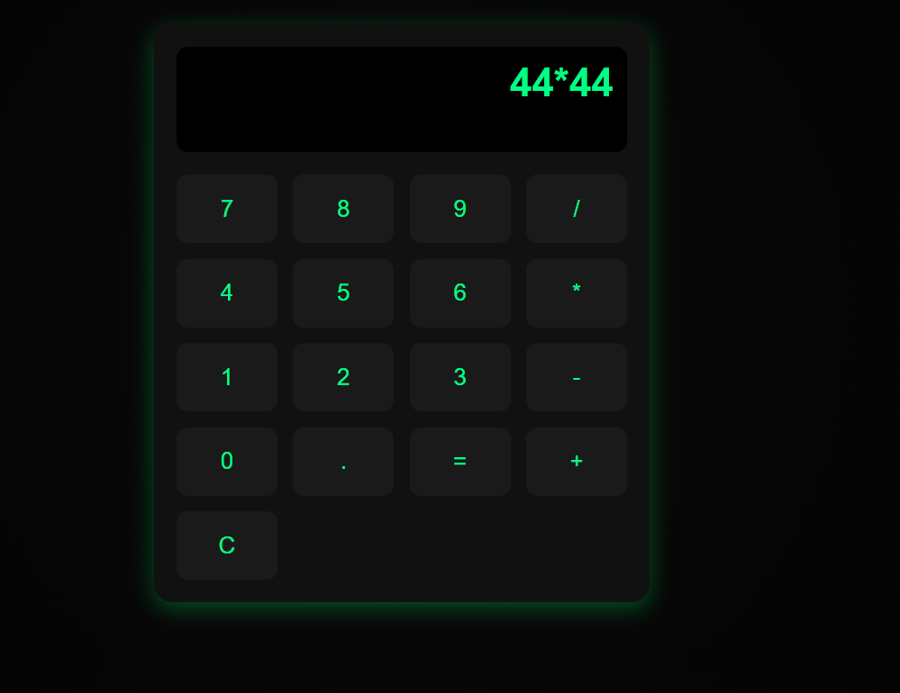
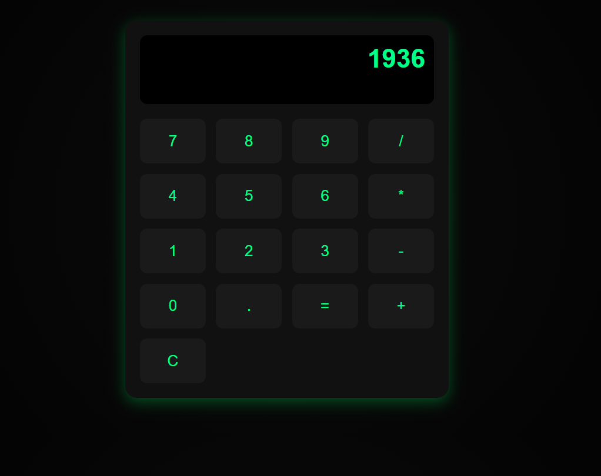

# MWAD-EXP_04-Simple-caluculator
## Date: 11-11-2025

## AIM
To  develop a Simple Calculator using React.js with clean and responsive design, ensuring a smooth user experience across different screen sizes.

## ALGORITHM
### STEP 1
Create a React App.

### STEP 2
Open a terminal and run:
  <ul><li>npx create-react-app simple-calculator</li>
  <li>cd simple-calculator</li>
  <li>npm start</li></ul>

### STEP 3
Inside the src/ folder, create a new file Calculator.js and define the basic structure.

### STEP 4
Plan the UI: Display screen, number buttons (0-9), operators (+, -, *, /), clear (C), and equal (=).

### STEP 5
Create a new file Calculator.css in src/ and add the styling.

### STEP 6
Open src/App.js and modify it.

### STEP 7
Start the development server.
  npm start

### STEP 8
Open http://localhost:3000/ in the browser.

### STEP 9
Test the calculator by entering numbers and operations.

### STEP 10
Fix styling issues and refine content placement.

### STEP 11
Deploy the website.

### STEP 12
Upload to GitHub Pages for free hosting.

## PROGRAM

### App.jsx
```
import React from 'react';
import Calculator from './calculator.jsx';

function App() {
  return (
    <div className="App">
      <Calculator />
    </div>
  );
}

export default App;


```

### Calculator.css
```
body {
  background: radial-gradient(circle at center, #0a0a0a 0%, #000 100%);
  color: #00ff88;
  font-family: 'Poppins', sans-serif;
}

.calculator {
  max-width: 400px;
  margin: 50px auto;
  padding: 20px;
  border-radius: 16px;
  background: #111;
  box-shadow: 0 6px 20px rgba(0, 255, 100, 0.3);
}

.display {
  height: 70px;
  background: #000;
  color: #00ff88;
  font-size: 2.2rem;
  font-weight: bold;
  padding: 12px;
  text-align: right;
  border-radius: 10px;
  overflow-x: auto;
}

.buttons {
  display: grid;
  grid-template-columns: repeat(4, 1fr);
  gap: 14px;
  margin-top: 20px;
}

button {
  padding: 18px;
  font-size: 1.3rem;
  border: none;
  border-radius: 10px;
  background-color: #1a1a1a;
  color: #00ff88;
  cursor: pointer;
  transition: all 0.2s ease;
}

button:hover {
  background-color: #00ff88;
  color: #111;
  transform: scale(1.05);
}

button:active {
  background-color: #00cc66;
}

button.operator {
  background-color: #00cc66;
  color: #fff;
}

button.clear {
  background-color: #ff4444;
  color: #fff;
}

```

### Calculator.jsx
```
import React, { useState, useEffect } from 'react';
import './Calculator.css';

const Calculator = () => {
  const [input, setInput] = useState('');

  const handleClick = (value) => {
    if (value === '=') {
      try {
        setInput(eval(input).toString());
      } catch {
        setInput('Error');
      }
    } else if (value === 'C') {
      setInput('');
    } else {
      setInput((prev) => prev + value);
    }
  };

  useEffect(() => {
    const handleKeyPress = (event) => {
      const { key } = event;

      if ((/^[0-9+\-*/.]$/).test(key)) {
        setInput((prev) => prev + key);
      } else if (key === 'Enter') {
        event.preventDefault();
        try {
          setInput(eval(input).toString());
        } catch {
          setInput('Error');
        }
      } else if (key === 'Backspace') {
        setInput((prev) => prev.slice(0, -1));
      } else if (key === 'Escape') {
        setInput('');
      }
    };

    window.addEventListener('keydown', handleKeyPress);
    return () => window.removeEventListener('keydown', handleKeyPress);
  }, [input]);

  return (
    <div className="calculator">
      <div className="display">{input || '0'}</div>
      <div className="buttons">
        {['7','8','9','/','4','5','6','*','1','2','3','-','0','.','=','+','C'].map((btn) => (
          <button key={btn} onClick={() => handleClick(btn)}>{btn}</button>
        ))}
      </div>
    </div>
  );
};

export default Calculator;


```

## OUTPUT





## RESULT
The program for developing a simple calculator in React.js is executed successfully.
